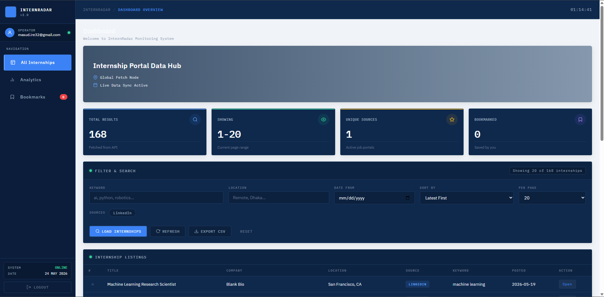
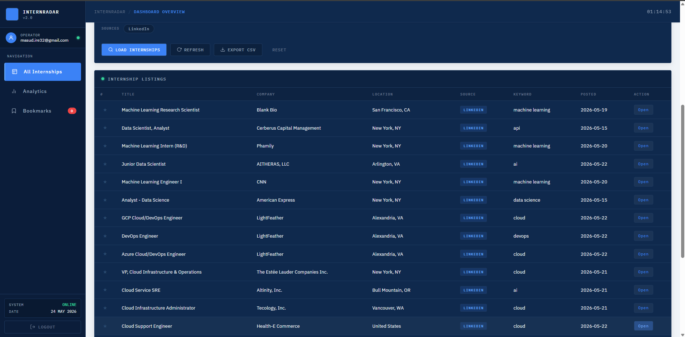
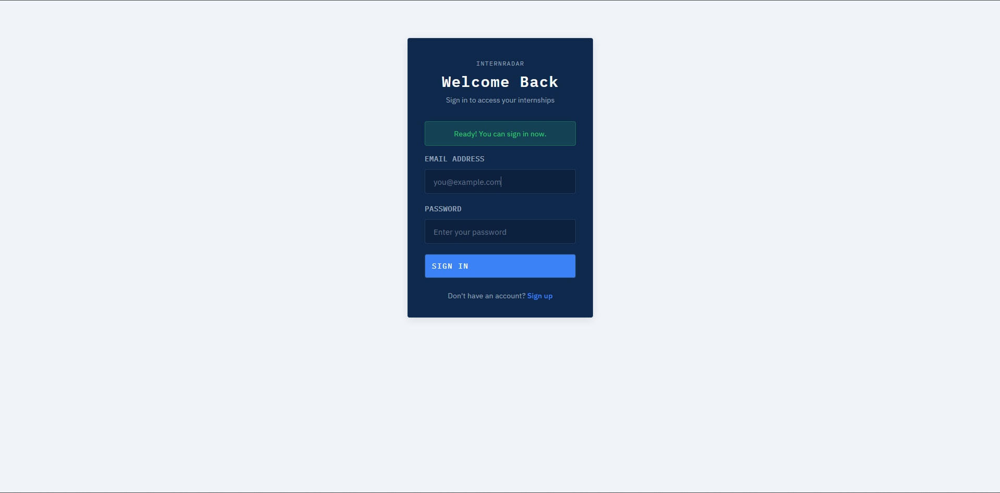
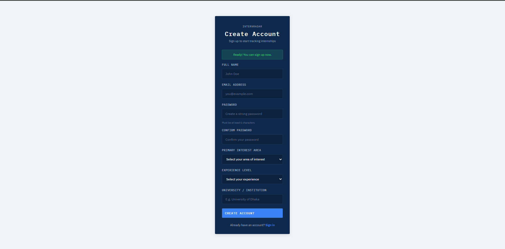
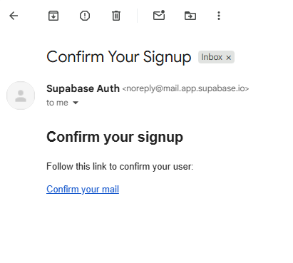

# InternRadar — Global Internship Aggregator & Monitoring System

<p align="center">
  
  
  
  
  
  
  
  
  
  
</p>

<p align="center">
  A highly responsive, API-driven internship aggregation platform designed to fetch, filter, and monitor global internship opportunities in real-time, featuring an enterprise-grade dark-cards-on-light-background aesthetic.
</p>

---

## Table of Contents

- [Overview](#-overview)
- [System Architecture](#-system-architecture)
- [Features](#-features)
- [Project Structure](#-project-structure)
- [Screenshots](#-screenshots)
- [Technology Stack](#-technology-stack)
- [How It Works](#-how-it-works)
- [API Reference](#-api-reference)
- [Database Schema](#-database-schema)
- [Deployment](#-deployment)
- [License](#-license)

---

## Overview

**InternRadar** is a full-stack platform built to simplify the search for internship opportunities across the globe. By consolidating data from multiple sources (like LinkedIn) into a single, unified monitoring system, it provides students and professionals with a centralized hub for their career search.

The system features a highly optimized FastAPI backend for fast data aggregation and a beautiful, modern frontend that leverages Supabase for real-time authentication and user-specific bookmarks.

**Live Links:**

- Dashboard (Frontend): [https://internrader.netlify.app](https://internrader.netlify.app)
- Backend API: [https://internrader-backend.onrender.com](https://internrader-backend.onrender.com)

---

## System Architecture

**Data Flow:**

1. User opens the InternRadar Dashboard → logs in via Supabase Auth.
2. Frontend requests internship data from the FastAPI backend.
3. Backend fetches live data from integrated APIs (e.g., LinkedIn API endpoints or mock sources) and applies query parameters (keywords, location).
4. Results are paginated and sent to the frontend for display.
5. Users can bookmark specific listings, saving the references securely to the Supabase PostgreSQL database.

---

## Features

### Frontend (User Dashboard)

| Feature                 | Description                                                |
| ----------------------- | ---------------------------------------------------------- |
| Real-time Data Hub      | Live internship fetching node with dynamic search.         |
| Advanced Filtering      | Filter opportunities by keyword, location, date, and source.|
| Bookmarking System      | Users can save internships to their personal profile.      |
| Pagination              | Efficient client-side navigation of large datasets.        |
| Professional Theme      | "Dark cards on a light background" with a sleek Hero Banner.|
| Authentication System   | Full login, signup, and password reset flows via Supabase. |

### Backend (FastAPI)

| Feature                 | Description                                                |
| ----------------------- | ---------------------------------------------------------- |
| Fast Data Aggregation   | Asynchronous data fetching across job sources.             |
| Search & Querying       | Flexible endpoint parameters (`limit`, `keyword`, `location`).|
| Security                | Configured CORS for Netlify frontend integration.          |

---

## Project Structure

```
InternRadar/
│
├── backend/                         # FastAPI backend
│   ├── main.py                      # FastAPI app + CORS + router registration
│   ├── models.py                    # Pydantic models 
│   ├── supabase_client.py           # Supabase DB integration logic
│   ├── schema.sql                   # Database table definitions
│   └── requirements.txt             # Backend dependencies
│
├── frontend/                        # Web dashboard (Static HTML/CSS/JS)
│   ├── index.html                   # Main Monitoring Dashboard
│   ├── login.html                   # Login Page
│   ├── signup.html                  # Registration Page
│   ├── forgot-password.html         # Password Reset Request
│   ├── reset-password.html          # Password Reset Form
│   ├── styles.css                   # Global styles & Color Variables
│   ├── app.js                       # Core dashboard logic (fetching, filtering)
│   └── supabase-lib.js              # Supabase Auth integration logic
```

---

## Screenshots

### Dashboard Overview


Shows the main internship listings, hero banner, search filters, and real-time statistics.

### Authentication Flow



Secure authentication pages utilizing the dark card on light background theme.

---

## Technology Stack

### Backend
| Tool                | Purpose                          |
| ------------------- | -------------------------------- |
| FastAPI             | REST API framework               |
| Python 3.10+        | Core backend language            |
| Uvicorn             | ASGI server                      |
| Render              | Cloud deployment                 |

### Frontend
| Tool               | Purpose                                       |
| ------------------ | --------------------------------------------- |
| HTML5 / CSS3       | Structure and styling (Vanilla CSS variables) |
| Vanilla JavaScript | API calls, state management, UI rendering     |
| Netlify            | Static site hosting with auto-deploys         |

### Database & Auth
| Tool          | Purpose                                                  |
| ------------- | -------------------------------------------------------- |
| Supabase      | PostgreSQL database + built-in Auth system               |
| Supabase Auth | Email/password login, token management                   |

---

## How It Works

### Step 1 — Authentication
Users authenticate via the `login.html` or `signup.html` pages. The frontend communicates directly with Supabase via `supabase-lib.js`. Session tokens are stored in `localStorage`.

### Step 2 — Data Fetching
Upon successful login, `app.js` initializes the dashboard. It fires a `GET` request to `https://internrader-backend.onrender.com/internships`. 

### Step 3 — Filtering & Interaction
When a user types a keyword or selects a source (e.g., LinkedIn), the dashboard dynamically appends query parameters to the API request, retrieving tailored results. Users can click the bookmark icon on any row to save that internship ID to their Supabase profile.

---

## API Reference

**Base URL:** `https://internrader-backend.onrender.com`

| Method | Endpoint                | Description                            |
| ------ | ----------------------- | -------------------------------------- |
| GET    | `/health`               | API health check                       |
| GET    | `/internships`          | Fetch internships (Query params available) |
| GET    | `/sources`              | Fetch available job sources            |

### GET /internships — Example Request
```http
GET /internships?limit=20&keyword=python&location=remote
```

---

## Database Schema


```sql
create table profiles (
  id uuid references auth.users not null primary key,
  full_name text,
  student_id text,
  created_at timestamp with time zone default timezone('utc'::text, now()) not null
);

create table bookmarks (
  id bigint generated by default as identity primary key,
  user_id uuid references auth.users not null,
  internship_id text not null,
  internship_title text,
  company text,
  created_at timestamp with time zone default timezone('utc'::text, now()) not null,
  unique(user_id, internship_id)
);
```

*(Note: Row Level Security (RLS) is enabled to ensure users can only see their own bookmarks.)*

---

## Deployment

### Frontend — Netlify
- Connected via GitHub integration.
- Pushes to the `main` branch automatically trigger a deploy.
- Live URL: `https://internrader.netlify.app`

### Backend — Render
- Hosted on Render Web Services.
- Start command: `uvicorn backend.main:app --host 0.0.0.0 --port $PORT`
- Live URL: `https://internrader-backend.onrender.com`

---

## Author

Shahriar Alom Masud  
B.Sc. Engg. in IoT & Robotics Engineering  
University of Frontier Technology, Bangladesh  
Email: shahriar0002@std.uftb.ac.bd  
LinkedIn: [https://www.linkedin.com/in/shahriar-alom-masud](https://www.linkedin.com/in/shahriar-alom-masud)

---

## License

See [LICENSE](LICENSE) file for full MIT License details.
